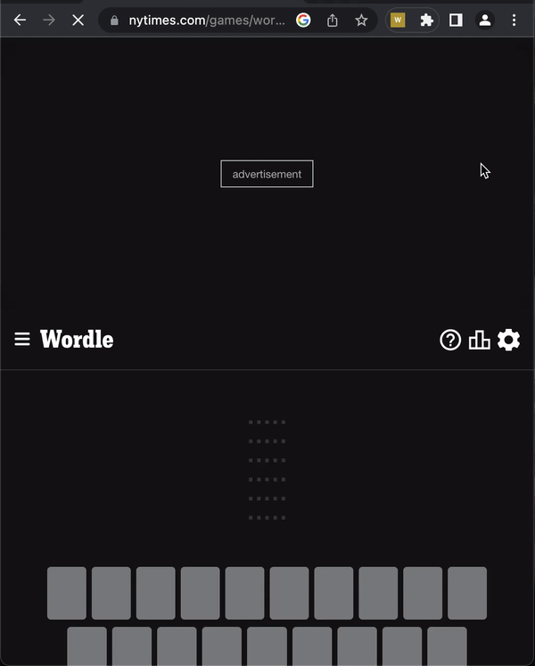

# NYT Wordle Timer

A chrome extension to time how long it takes to solve the daily [NYT Wordle](https://www.nytimes.com/puzzles/wordle) puzzle.

## Installation

1. Download the latest release.
2. Unzip files somewhere.
3. In a blank Chrome window, navigate to `chrome:extensions` in the URL bar.
4. Ensure "Developer mode" is enabled in the upper right-hand corner.
5. In the upper left-hand corner, click "Load unpacked".
6. Select the directory with the unzipped files and click "OK".
7. Start playing!
